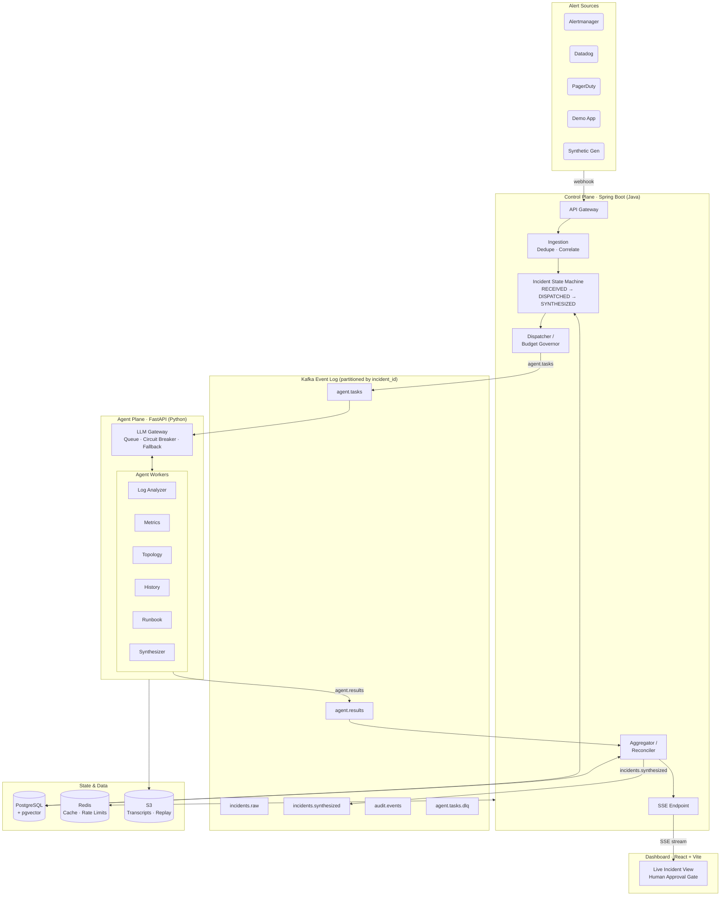

# Sentinel

**An AI agent swarm that triages production incidents in seconds instead of minutes.**

When a system breaks at 3 AM, an on-call engineer normally spends 20–40 minutes digging through logs, metrics, dashboards, and old tickets just to *understand* the problem. Sentinel replaces that first half-hour with a team of specialized AI agents that investigate in parallel and hand the engineer a single, clear diagnosis with a recommended fix.

> **Project status:** Sprint 1 complete. The full one-agent pipeline is end-to-end: alert → classify → dispatch → LLM → trace → `RESOLVED`. 31 Java tests, 9 Python tests, all green. Real two-language CI on every PR. See [What's built](#whats-built) for the current state and [Roadmap](#roadmap) for the full plan.

---

## The problem

Modern incident response forces a tired human to be a fast detective. They open five tools, scroll thousands of log lines, cross-check graphs, search past incidents, and find the right runbook — all under pressure, all before they can even start fixing anything.

A single large AI model handling all of that does it poorly: too many concerns, shallow reasoning, no specialization.

## The approach

Sentinel uses a **swarm of specialist agents**, each narrow and good at one job, working in parallel — like a hospital ER team where the nurse, radiologist, lab tech, and specialist all work on one patient simultaneously instead of one after another.

Five investigators each produce a fragment of the picture; a sixth agent combines them into one answer:

| Agent | Job | Example finding |
|---|---|---|
| **Log Analyzer** | Scans error logs around the incident window | "200 DB timeout errors in the last 5 minutes" |
| **Metrics** | Reads metrics and checks SLO violations | "Memory climbing fast — looks like a leak" |
| **Topology** | Maps service dependencies and recent deploys | "A deploy hit this service 10 minutes ago" |
| **History** | Searches past incidents for similar patterns | "We saw this in March — bad DB query" |
| **Runbook** | Matches the incident to documented playbooks | "Runbook exists — step 1: roll back" |
| **Synthesizer** | Combines all findings into one report | Final diagnosis + recommended fix + confidence |

The result, delivered in seconds: *what broke, why, whether it's been seen before, and what to do — with a confidence score.* A human reviews it on a live dashboard and approves or edits.

---

## Architecture

Sentinel is built as a hybrid system across two runtimes, connected by a durable event log:

- **Control Plane — Spring Boot (Java):** alert ingestion, classification, dispatch, orchestration, budget governance, result aggregation. Stateless and horizontally scalable.
- **Agent Plane — FastAPI (Python):** the agent swarm, LLM gateway, and tool layer. Sandboxed and least-privilege.
- **Event Log — Kafka:** durable, partitioned by incident, the source of truth for events. Decouples the planes so a slow or failed agent never blocks the system.



### Design principles

- **Idempotent ingestion** — duplicate alerts are deduplicated; alert storms collapse into a single incident.
- **Durable incident state** — the incident lifecycle is an explicit state machine persisted in Postgres, so any orchestrator replica can resume any incident after a crash.
- **Graceful degradation** — if an agent times out, the system proceeds with a `PARTIAL` result and flags the gap rather than blocking.
- **Bounded cost** — token budgets are enforced per-incident, per-tenant, and globally, with a kill switch.
- **Resilient LLM calls** — a dedicated LLM gateway adds queueing, circuit breakers, retries, and a model fallback ladder.
- **Self-observability** — Sentinel runs its own isolated telemetry stack so a customer outage never blinds Sentinel itself.
- **Extensible swarms** — agents are registered by capability, so new swarm types can be added without rewriting the orchestrator.

---

## Tech stack

| Layer | Technology |
|---|---|
| Control plane | Java, Spring Boot |
| Agent plane | Python, FastAPI |
| Event bus | Apache Kafka |
| Storage | PostgreSQL (+ pgvector), Redis, S3-compatible object store |
| LLM backends | Ollama (local, dev) · Anthropic / Groq API (production) |
| Observability | Prometheus, Loki, Grafana, OpenTelemetry |
| Frontend | React, Vite, Tailwind, Server-Sent Events |
| Infrastructure | Docker Compose (dev), Kubernetes (production) |
| CI/CD | GitHub Actions |

---

## What's built

> Sprint 1 complete — 31 Java tests · 9 Python tests · full pipeline end-to-end

| Component | Status | Details |
|---|---|---|
| Monorepo structure | ✅ Done | All directories, Docker Compose, real CI |
| Docker Compose stack | ✅ Done | Postgres 16, Redis 7, Apache Kafka — all healthy |
| Postgres schema | ✅ Done | Flyway V1: `incidents`, `agent_traces`, `incident_reports`, `audit_log`, `prompt_versions` |
| JPA entities + repos | ✅ Done | All entities, Hibernate 6, `IncidentRepository` with dedup query |
| Kafka topics | ✅ Done | 6 topics provisioned on startup; Kafka health indicator |
| Alert ingestion | ✅ Done | `POST /alerts` — validates, deduplicates (SHA-256), persists `RECEIVED`, publishes to `incidents.raw` |
| Incident state machine | ✅ Done | Explicit transitions `RECEIVED→CLASSIFIED→DISPATCHED→AGGREGATING→SYNTHESIZED→RESOLVED`, all audited |
| Classifier + Dispatcher | ✅ Done | Consumes `incidents.raw`, assigns severity, publishes `AgentTask` to `agent.tasks` |
| Python agent service | ✅ Done | FastAPI + aiokafka; `KafkaWorker` with DLQ; LLM abstraction (Ollama/Anthropic/Groq) |
| Echo agent + LLM layer | ✅ Done | `OllamaClient` (real), stub backends; `echo_agent` wraps LLM response in `AgentResult` |
| Aggregator | ✅ Done | Consumes `agent.results`, records trace, resolves incident, publishes to `incidents.synthesized` |
| CI | ✅ Done | Java (mvn verify) + Python (ruff/mypy/pytest) jobs run in parallel on every PR |
| React dashboard | 🔜 Sprint 3 | SSE-powered live incident view with human approval gate |

---

## Getting started

> Prerequisites: Java 21, Python 3.11, Docker, [Ollama](https://ollama.ai) with `qwen3:14b` pulled (`ollama pull qwen3:14b`).

```bash
# Clone
git clone https://github.com/NikunjS91/Sentinel.git
cd Sentinel

# Start infrastructure (Postgres 16, Redis 7, Kafka)
docker compose up -d

# Terminal A — control plane (port 8080)
cd orchestrator && ./mvnw spring-boot:run

# Terminal B — agent plane (port 8001)
cd agents && pip install -e ".[dev]"
uvicorn app.main:app --port 8001

# Terminal C — fire an alert and watch it resolve
curl -i -X POST http://localhost:8080/alerts \
  -H 'Content-Type: application/json' \
  -d @sample-alert.json
# → 201 Created  (new incident, starts the pipeline)
# → Same curl again → 200 OK (deduplicated — same incident ID returned)

# Wait ~15s for the LLM call, then inspect the outcome
docker compose exec postgres psql -U sentinel -d sentinel \
  -c "SELECT id, state, severity FROM incidents;"
# state should be RESOLVED

docker compose exec postgres psql -U sentinel -d sentinel \
  -c "SELECT agent_name, status, tokens_used FROM agent_traces;"

docker compose exec postgres psql -U sentinel -d sentinel \
  -c "SELECT summary FROM incident_reports;"

# Run all tests (requires Docker)
cd orchestrator && ./mvnw verify          # 31 Java tests
cd ../agents && ruff check . && mypy . && pytest  # 9 Python tests
```

> Day-plan docs are in `docs/`. `sample-alert.json` is at the repo root.

---

## Roadmap

The project is built in six two-week sprints, scoped as **Phase 1** of a longer vision.

### Phase 1 — Diagnosis Swarm (MVP)

- [x] **Sprint 1** — Foundation: full pipeline end-to-end ✅ — alert ingestion, state machine, classifier/dispatcher, Python agent service, LLM abstraction (Ollama), aggregator, 31+9 tests, real CI
- [ ] **Sprint 2** — Demo app emitting realistic telemetry, synthetic incident generator, Log Analyzer + Metrics agents
- [ ] **Sprint 3** — Synthesizer agent, parallel dispatch, partial-result handling, live React dashboard with SSE
- [ ] **Sprint 4** — Topology, History (pgvector), and Runbook agents
- [ ] **Sprint 5** — Production hardening: circuit breakers, budgets, evaluation harness, prompt versioning
- [ ] **Sprint 6** — Kubernetes manifests, CI/CD pipeline, documentation, demo

### Beyond Phase 1

- **Remediation Swarm** — a second swarm (rollback, scaling, traffic-shifting, verification agents) that begins fixing the incident in parallel with diagnosis, behind a human-approval safety gate.
- **Integrations** — adapters for Datadog, New Relic, PagerDuty, GitHub, and Kubernetes.
- **Collective intelligence** — anonymized incident-pattern learning so a fix discovered in one environment helps resolve similar incidents elsewhere.

---

## Why this project exists

Sentinel is a portfolio and learning project exploring multi-agent AI systems applied to a real, hard operations problem: incident response. It is designed around production-grade concerns — reliability, failure handling, observability, cost control, and security — rather than a happy-path demo.

## License

MIT — see [LICENSE](LICENSE).

## Author

**Nikunj Shetye** — [LinkedIn](https://www.linkedin.com/in/nikunj-shetye) · [GitHub](https://github.com/NikunjS91)
