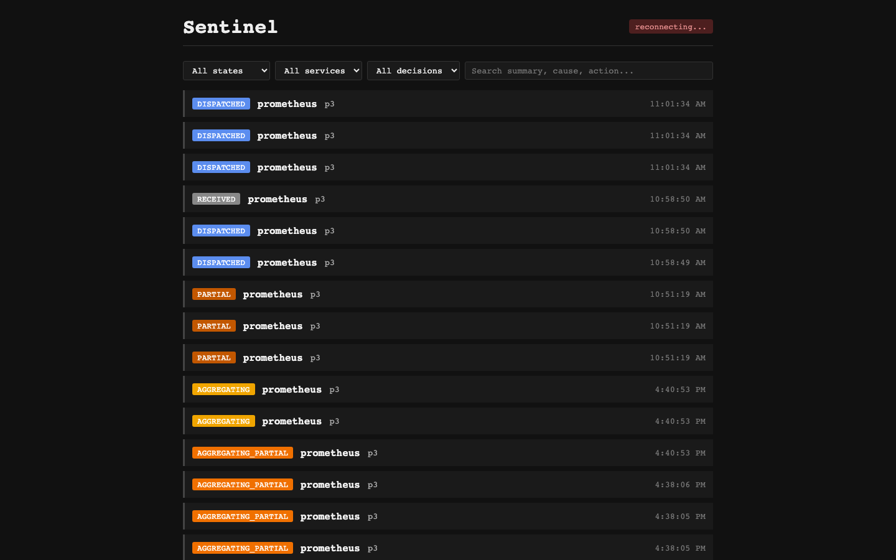
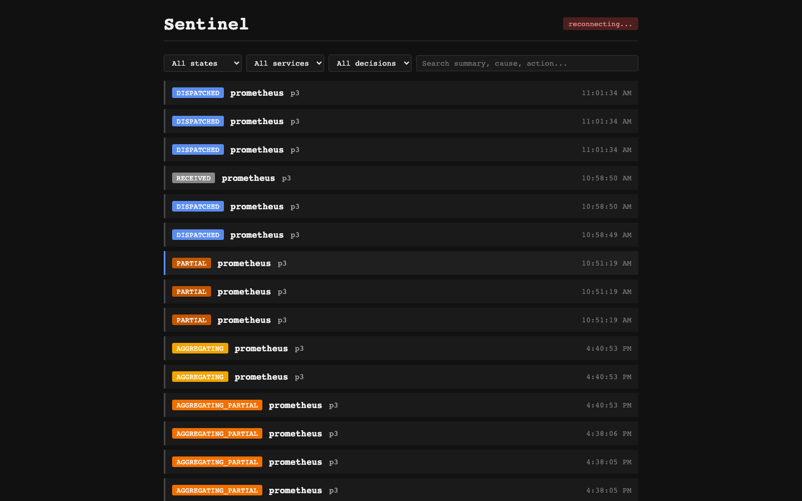
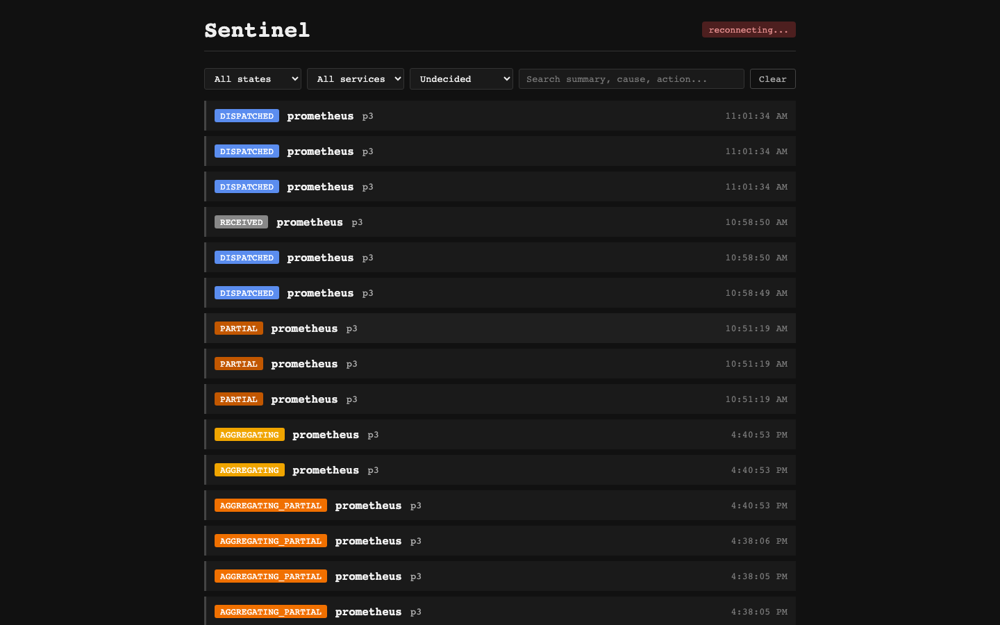
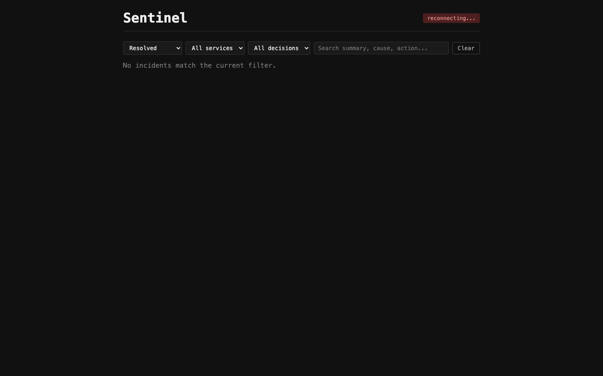
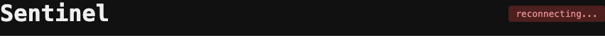
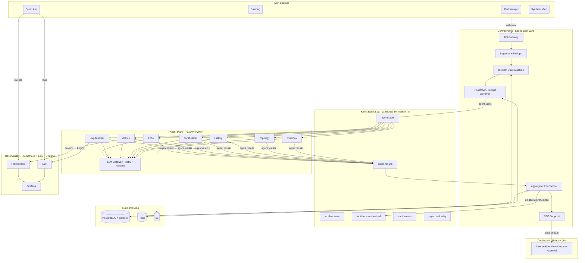

# Sentinel

> Multi-agent AI incident-triage swarm with a self-learning knowledge base.



Six specialist AI agents diagnose incidents in parallel — logs, metrics, history, topology,
runbooks. A Synthesizer combines their findings into a single calibrated report with explicit
dissent notes when they disagree. Every operator-reviewed incident becomes labeled training
data, captured in a pgvector-backed knowledge base that the History agent searches on future
incidents.

**Status:** Sprint 4 complete — 145+ tests across two languages, ruff + mypy clean,
four parallel CI jobs green on `main`.
[See the sprint retrospectives →](docs/retrospectives/)

---

## What it looks like

### Live dashboard — incidents in all states


Each card shows the incident state (color-coded pill), service name, alert name, and a
severity indicator. Cards update in real time over SSE — no page refresh needed.

### Expanded incident — root cause, confidence, and dissent notes



The Synthesizer's report includes a calibrated confidence score and **dissent notes** — explicit
acknowledgments when specialists reached different conclusions. On a `slow_query` incident, the
Log Analyzer reports low confidence (metrics-only signal) while the Metrics agent reports high
confidence with concrete p95 evidence. The Synthesizer names that disagreement rather than
averaging it away.

### SRE working queue (filter: undecided)



Filter by state, service, decision status, or free-text. The URL is bookmarkable — share
`?decision=undecided` to point a teammate directly at the review queue.

### Terminal state view (filter: RESOLVED)



Resolved incidents stay in the list for review. Operators can accept the AI's report, reject it
with a reason, or edit specific fields. The original AI output is *preserved alongside* the human
edit — every correction becomes a labeled training example for the Sprint 5 eval harness.

### Real-time connection status



The header connection indicator shows **live** (green) when the SSE stream is healthy, or
**reconnecting...** (red) on transient disconnects. The client reconnects automatically with
no data loss — Kafka retains events until the orchestrator processes them.

---

## The problem

Modern incident response forces a tired human to be a fast detective. They open five tools,
scroll thousands of log lines, cross-check graphs, search past incidents, and find the right
runbook — all under pressure, all before they can even start fixing anything.

A single large AI model handling all of that does it poorly: too many concerns, shallow
reasoning, no specialization.

## The approach

Sentinel uses a **swarm of specialist agents**, each narrow and good at one job, working in
parallel — like a hospital ER team where the nurse, radiologist, lab tech, and specialist all
work on one patient simultaneously instead of sequentially.

Six specialist investigators run in parallel on every incident. They feed a Synthesizer that
combines their findings into one answer. An SRE reviews the diagnosis on a live dashboard and
has the final say:

| Agent | Job | Example finding | Status |
|---|---|---|---|
| **Log Analyzer** | Scans error logs around the incident window | "200 DB timeout errors in the last 5 minutes" | ✅ Sprint 2 |
| **Metrics** | Reads PromQL queries and checks SLO violations | "p95 latency 0.82s exceeds SLO — DB query latency" | ✅ Sprint 2 |
| **Synthesizer** | Combines all findings — names disagreements as dissent notes | Final diagnosis + confidence score + dissent notes | ✅ Sprint 3 |
| **History** | Searches past incidents for similar patterns via pgvector | "Seen in March — same DB query pattern" | ✅ Sprint 4 |
| **Topology** | Maps service-graph neighbors, reasons about failure propagation | "payment-service (outgoing dep) likely implicated" | ✅ Sprint 4 |
| **Runbook** | Matches the incident to documented playbooks via PostgreSQL FTS | "Runbook found — step 1: roll back last deploy" | ✅ Sprint 4 |

The result: *what broke, why, whether it's been seen before, and what to do — with a confidence
score.* A human reviews it on a live dashboard, then accepts, rejects, or edits the AI's
recommendation. Every edit is stored alongside the AI's original as labeled training data.

---

## Architecture

Sentinel is built across four planes, connected by a durable event log:

- **Control Plane — Spring Boot (Java):** alert ingestion, classification, dispatch, result aggregation, incident state machine, human-in-the-loop endpoints, SSE stream. Stateless and horizontally scalable.
- **Agent Plane — FastAPI (Python):** the agent swarm, LLM gateway, and tool layer. Sandboxed and least-privilege.
- **Event Log — Kafka:** durable, partitioned by incident, the source of truth for events. Decouples the planes so a slow or failed agent never blocks the system.
- **Dashboard — React + Vite:** live incident list via SSE, filter bar with URL sync, per-incident detail expansion, accept/reject/edit human decision controls.
- **Observability — Prometheus + Loki + Grafana:** containerized telemetry stack; the demo app emits structured metrics and logs; agents query both via PromQL and LogQL during incident triage.



### Incident state machine

```
RECEIVED → CLASSIFIED → DISPATCHED → AGGREGATING ──► SYNTHESIZED → RESOLVED
                                             │
                                             └──► AGGREGATING_PARTIAL → SYNTHESIZED_PARTIAL → PARTIAL
any state → FAILED  (terminal, on unrecoverable error)
```

All transitions are persisted in Postgres and recorded to `audit.events`. If agents miss their
deadline, the sweeper moves the incident to the `PARTIAL` path and still produces a Synthesizer
report from whatever partial data arrived — no silent failures.

### Design principles

- **Idempotent ingestion** — duplicate alerts are deduplicated (SHA-256 fingerprint); alert storms collapse into one incident. *(Sprint 1)*
- **Durable incident state** — the lifecycle is an explicit state machine in Postgres; any orchestrator replica can resume after a crash. *(Sprint 1)*
- **Extensible swarms** — agents are registered in a dict; adding a new specialist is two edits (registry + dispatcher). *(Sprint 2)*
- **Self-observability** — Sentinel runs its own isolated Prometheus/Loki/Grafana stack; a customer outage never blinds Sentinel itself. *(Sprint 2)*
- **Graceful degradation** — if an agent times out, the system proceeds with a `PARTIAL` result and flags missing agents in the dissent notes rather than blocking. *(Sprint 3)*
- **Resilient LLM calls** — dedicated LLM gateway with retry, model fallback ladder, and per-incident token budgets. *(retry: Sprint 1; circuit breakers + budgets: Sprint 5)*
- **Self-learning knowledge base** — resolved incidents write back to pgvector; the History agent searches them on future incidents. *(Sprint 4)*

---

## Tech stack

| Layer | Technology |
|---|---|
| Control plane | Java 21, Spring Boot 3 |
| Agent plane | Python 3.11, FastAPI |
| Event bus | Apache Kafka |
| Storage | PostgreSQL 16 + pgvector, Redis 7, S3-compatible object store |
| LLM backends | Ollama (local / dev) / Anthropic / Groq (production) |
| Observability | Prometheus, Loki, Grafana, structured JSON logs |
| Frontend | React 18, Vite, Tailwind CSS, Server-Sent Events |
| Infrastructure | Docker Compose (dev), Kubernetes (Sprint 6) |
| CI/CD | GitHub Actions — 4 parallel jobs on every PR |

---

## What's built

> Sprint 4 complete — ~85 Java tests · ~60 Python tests · 8 demo-app tests · four CI jobs · 6-agent swarm + pgvector knowledge base + self-learning feedback loop

| Component | Status | Details |
|---|---|---|
| Monorepo structure | ✅ Sprint 1 | All directories, Docker Compose, real CI |
| Docker Compose stack | ✅ Sprint 1 | Postgres 16, Redis 7, Apache Kafka, Prometheus, Loki, Grafana, Promtail, MinIO |
| Postgres schema | ✅ Sprint 1 | Flyway V1–V4: incidents, agent_traces, incident_reports, audit_log, prompt_versions |
| JPA entities + repos | ✅ Sprint 1 | All entities, Hibernate 6, `IncidentRepository` with dedup query |
| Kafka topics | ✅ Sprint 1 | 6 topics provisioned on startup; Kafka health indicator |
| Alert ingestion | ✅ Sprint 1 | `POST /alerts` — validates, deduplicates (SHA-256), persists `RECEIVED`, publishes to `incidents.raw` |
| Incident state machine | ✅ Sprint 1 | Full lifecycle: `RECEIVED→CLASSIFIED→DISPATCHED→AGGREGATING→SYNTHESIZED→RESOLVED` + PARTIAL path, all audited |
| Classifier + Dispatcher | ✅ Sprint 1 | Consumes `incidents.raw`, assigns severity, publishes `AgentTask` to `agent.tasks` |
| Python agent service | ✅ Sprint 1 | FastAPI + aiokafka; `KafkaWorker` with DLQ; LLM abstraction (Ollama / Anthropic / Groq) |
| Echo agent + LLM layer | ✅ Sprint 1 | `OllamaClient` (real), stub backends; `echo_agent` wraps LLM response in `AgentResult` |
| Aggregator | ✅ Sprint 1 | Consumes `agent.results`, records trace, resolves incident, publishes to `incidents.synthesized` |
| CI | ✅ Sprint 1 | Four parallel jobs: orchestrator / agents / demo-app / UI build — on every PR |
| Demo app | ✅ Sprint 2 | Spring Boot breakable service — 3 endpoints, 4 failure modes, Prometheus + structured-JSON logs |
| Observability stack | ✅ Sprint 2 | Prometheus, Loki, Promtail, Grafana — containerized, datasource-provisioned, queryable |
| Tool layer | ✅ Sprint 2 | `query_logs` (Loki/LogQL) + `query_metrics` + `slo_violations` (Prometheus/PromQL) — async, fixture-mode |
| Prompt registry | ✅ Sprint 2 | Versioned, immutable, Postgres-synced; `.txt` files loaded at startup |
| Log Analyzer agent | ✅ Sprint 2 | LLM agent scanning logs around incident; defensive JSON parsing with retry |
| Metrics agent | ✅ Sprint 2 | LLM agent reading 3 PromQL queries + SLO violations; calibrated confidence |
| Three-agent dispatch | ✅ Sprint 2 | Dict-based registry; `expected_agents` per incident; aggregator resolves dynamically |
| Swarm asymmetry | ✅ Sprint 2 | TC-2.11.2 codifies: Metrics ≈0.88 confidence vs Log Analyzer ≈0.15 on `slow_query` |
| Synthesizer agent | ✅ Sprint 3 | Meta-agent combining specialists' findings; dissent notes surface explicit disagreements |
| Two-stage dispatch | ✅ Sprint 3 | Specialists first; Synthesizer receives their findings in payload; not counted in `expected_agents` |
| Per-incident deadlines | ✅ Sprint 3 | `deadline_at` set at dispatch; `DeadlineSweeper` transitions overdue incidents to PARTIAL path |
| PARTIAL terminal state | ✅ Sprint 3 | Three new states (`AGGREGATING_PARTIAL → SYNTHESIZED_PARTIAL → PARTIAL`) preserve full audit lineage |
| React dashboard | ✅ Sprint 3 | SSE-powered live incident list; dark monospace theme; color-coded state pills; no UI library |
| Human-in-the-loop | ✅ Sprint 3 | `POST /accept`, `POST /reject`, `PATCH /report`; AI originals preserved; edits = labeled training data |
| Filter bar + pagination | ✅ Sprint 3 | `GET /incidents` — state / service / decision / free-text; URL-synced; cursor pagination |
| Knowledge-base infrastructure | ✅ Sprint 4 | pgvector schema: `kb_documents` (vector similarity) + `kb_links` (topology graph) + `kb_runbooks` (FTS); `/kb/search`, `/kb/topology/{service}`, `/kb/runbooks/{service}` REST API; seed data; embedding abstraction (fixture + sentence-transformers) |
| History agent | ✅ Sprint 4 | Embeds incident query, searches `/kb/search`, finds semantically similar past incidents; `KbWriter` inserts resolved incidents back; `EmbeddingBackfillTask` fills NULL vectors async |
| Topology agent | ✅ Sprint 4 | Fetches `/kb/topology/{service}`, flattens neighbors, reasons about failure-propagation direction (outgoing = likely causes, incoming = likely victims); skips LLM when no topology data |
| Runbook agent | ✅ Sprint 4 | PostgreSQL FTS over `kb_runbooks` (`to_tsvector` / `plainto_tsquery`); calibrated confidence (0.0 no match → 0.8+ strong match); post-guard fills results when LLM returns empty |
| Six-agent dispatch | ✅ Sprint 4 | echo + log_analyzer + metrics + history + topology + runbook dispatched per incident; 2-edit extension contract held across all Sprint 4 agents |

---

## Getting started

> **Prerequisites:** Java 21, Node 18+, Python 3.11, Docker Desktop, [Ollama](https://ollama.ai) with `qwen3:14b` pulled.

```bash
ollama pull qwen3:14b
```

```bash
# 1. Clone
git clone https://github.com/NikunjS91/Sentinel.git
cd Sentinel
cp .env.example .env   # review defaults — no changes needed for local dev

# 2. Start infrastructure (Postgres 16, Redis 7, Kafka, Prometheus, Loki, Grafana, Promtail, MinIO)
docker compose up -d
docker compose ps      # wait until all 8 services are healthy

# Terminal A — control plane (port 8080)
cd orchestrator && ./mvnw spring-boot:run

# Terminal B — agent plane (port 8001)
cd agents
python -m venv .venv && source .venv/bin/activate
pip install -e ".[dev]"
uvicorn app.main:app --port 8001

# Terminal C — live dashboard (port 5173)
cd ui && npm install && npm run dev
# Open http://localhost:5173

# Terminal D — fire an alert and watch the swarm work
curl -i -X POST http://localhost:8080/alerts \
  -H 'Content-Type: application/json' \
  -d @sample-alert.json
# 201 Created  → new incident dispatches all 6 agents
# Same curl    → 200 OK (deduplicated — same incident ID returned)
# Dashboard: state pill cycles RECEIVED → DISPATCHED → AGGREGATING → RESOLVED (~10 min on CPU-only Ollama)
# Click the incident card to expand: summary, root cause, confidence score, dissent notes
# Click Accept / Reject / Edit to record your decision as labeled training data

# Optional: inject a slow_query failure and observe swarm asymmetry
curl -s -X POST http://localhost:8090/admin/failure-mode \
  -H 'Content-Type: application/json' -d '{"mode":"slow_query"}'
# Metrics agent ≈0.88 confidence vs Log Analyzer ≈0.15 — disagreement visible in dissent notes
```

**Demo walkthroughs:**
- [Sprint 2 — Swarm asymmetry](docs/demos/SPRINT-2-SWARM-ASYMMETRY.md)
- [Sprint 3 — Human-in-the-loop](docs/demos/SPRINT-3-HUMAN-IN-LOOP.md)
- [Sprint 4 — Knowledge feedback loop](docs/demos/SPRINT-4-KNOWLEDGE-LOOP.md)

**Run the test suites** (requires Docker):

```bash
cd orchestrator && ./mvnw verify                       # ~85 Java tests
cd ../agents && ruff check . && mypy . && pytest       # ~60 Python tests
cd ../demo-app && mvn verify                           # 8 demo-app tests
cd ../ui && npm run build                              # TypeScript + Vite build gate
```

> Day-plan docs are in `docs/`. The sample alert payload is at `sample-alert.json` in the repo root.

---

## Roadmap

The project is built in six sprints, scoped as **Phase 1** of a longer vision.

### Phase 1 — Diagnosis Swarm (MVP)

- [x] **Sprint 1** — Full pipeline end-to-end: alert ingestion, state machine, classifier/dispatcher, Python agent service, LLM abstraction (Ollama), aggregator, 31+9 tests, real CI ✅
- [x] **Sprint 2** — Demo app + full observability stack, Log Analyzer + Metrics agents, tool layer, prompt registry, dict dispatch, swarm asymmetry codified ✅ — ~40+37+8 tests
- [x] **Sprint 3** — Synthesizer agent, two-stage dispatch, per-incident deadlines + PARTIAL state, live React dashboard with SSE, human-in-the-loop accept/reject/edit ✅ — ~73+42+8 tests
- [x] **Sprint 4** — 6-agent swarm (History, Topology, Runbook), pgvector knowledge base, self-learning feedback loop ✅ — ~85+60+8 tests
- [ ] **Sprint 5** — Production hardening: eval harness, deadline calibration, circuit breakers, DLQ, token budgets
- [ ] **Sprint 6** — Kubernetes manifests, CI/CD pipeline, load testing, documentation

### Beyond Phase 1

- **Remediation Swarm** — a second swarm (rollback, scaling, traffic-shifting, verification agents) that begins fixing the incident in parallel with diagnosis, behind a human-approval gate.
- **Integrations** — adapters for Datadog, New Relic, PagerDuty, GitHub, and Kubernetes.
- **Collective intelligence** — anonymized incident-pattern learning so a fix discovered in one environment helps resolve similar incidents elsewhere.

---

## Why this project exists

Sentinel is a portfolio project exploring multi-agent AI systems applied to a real, hard
operations problem: production incident response. It is designed around production-grade
concerns — reliability, failure handling, observability, cost control, and security — rather
than a happy-path demo.

## License

MIT — see [LICENSE](LICENSE).

## Author

**Nikunj Shetye** — [LinkedIn](https://www.linkedin.com/in/nikunj-shetye) · [GitHub](https://github.com/NikunjS91)
